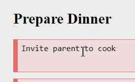

# Todo List

This project is a customized todo-list for my own use. This application is implemented with React.js, Redux, HTML, JS and CSS. Currently, it includes functions of adding to-do tasks, adding subtasks, changing task priority and managing task lifecycle. It will be kept scaling so as to fit my personal needs.

## Demo Webpage
https://paulyaniscoding.github.io/Todo-List/

## Deploy in Local Environment

Run the following commands one by one: 
`npm install` 
`npm start`

## Responsive Layout

## Features
### Add Tasks
1.Add Task Category 

2.Add Task Content 

3.Successful! 

### Add Sub-tasks
1.Click the Expand button 

2.Add Sub-task Content 

3.Click the Add Button 

4.Successful! 

### Drag to Change Priority
Tasks of same category and same parent task can be sorted by dragging.

### Edit Tasks
1.Click the text in the task body 

A2.Edit and then Click the Update Button 

A3.Successful

B2.Click the Undo Button to Discard unwanted change

B3.Undo Successful

### Manage Task Lifecycle
There are four states in the task lifecycle, which are "Not Started", "WIP", "Paused", and "Done". Action buttons are added for users to update the task status.

(Task Lifecycle Diagram)  

(Color Prompt for Different States)
